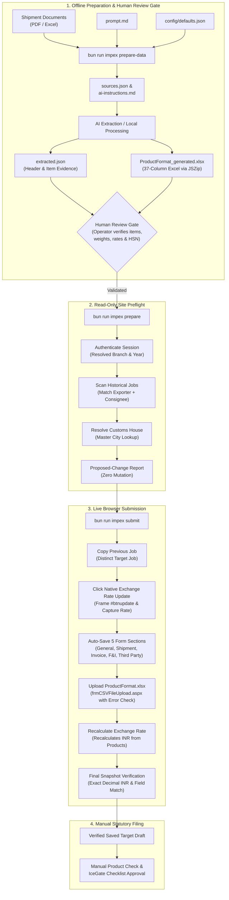

# Impex Cube recurring-exporter automation

Copies a previous job into a new job and updates the draft from current documents. It prefers the latest eligible job for the same exporter IEC + consignee, otherwise the latest exporter job in the selected branch/year. It leaves native-copied Product rows for your manual edits, uses an explicit allowlist of inspected website controls and automatically saves General, Shipment, Invoice, F&I and Third Party details. It resets inherited shipping-bill and transport references.

Section scope follows website function and mapped controls, independent of screenshot filenames. Product and its sub-tabs, IceGate, Dummy Job Info, Job Status, e-Sansit, Container Details, Document uploads, and Checklist approval/filing remain manual. Exchange rates use the site’s native Update action; calculated fields are verified against the site rather than overwritten. Control mappings in `src/policy/fields.ts` document the website behavior.

The tool is implemented and tested locally. Section snapshots are read in one browser call, and known-IEC discovery visits jobs newest first and stops at the first matching consignee. The first live draft was copied and its mapped sections saved/read back. Native Exchange Rate Update is used before document-field saves; copied Product preservation needs a manual check. Completed examples are references and cannot be run.

## Workflow Architecture



## Division of work and timing

The scripts extract document text, validate evidence, select the previous job, copy once, fill mapped controls, save and verify. Codex/your AI reads the original documents and extraction output, resolves interpretation with your instructions and writes `extracted.json`. Product edits and final filing review remain manual. There is no measured script/AI percentage or unattended AI extraction service.

For every run or resume that processes a draft, click the site's native Exchange Rate Update button exactly once before filling the sections—even when the saved rate already matches. Use the rate saved by that action; do not compare it with an old preview or block normal fluctuations. Apply document invoice amounts afterward because Update can recalculate them from copied Products. Final verification checks the saved invoice rate and INR calculation.

A fresh live one-invoice run took 76.34 seconds: login 1.63s, preflight (document validation, source selection and customs lookup) 29.54s, copy/target checks/rate update 3.84s, five-section filling and saving 21.38s, and final target/source verification 19.92s. The documents had already been interpreted. This observation excludes AI interpretation, test cleanup, debugging, manual Product edits and filing; it is not an end-to-end shipment completion time or a guaranteed duration. Site response times and shipment complexity affect it.

Navigation follows native buttons on the current verified job: General → Shipment → Invoice, with F&I and Third Party tabs on the selected invoice. Returning from Exchange Rate uses General Details; returning from Shipment/Invoice uses Job Details. URLs open a different job or a fresh final snapshot. The selected invoice is read once per navigation decision and reused only while its marker and live number agree. Changed sections are saved without a per-section reload/readback; already-correct sections are checked before filling and skipped. Persisted-value verification runs once at the end, after all section saves, using fresh source and target snapshots. Save/postback completion and target/session guards remain active throughout. Identity checks read context and job identifiers together. A final fresh source and target read remains necessary because later saves can recalculate invoice values. Verification visits the source first and finishes on the target. Source option inspection still reloads between sections to discard unsaved preview selections.

A visible rerun of an already-matching draft took 9.85 seconds, compared with 13.05 seconds before native-route simplification. It loaded General three times: initial target identity, final source verification and final target verification. These are existing-target rerun measurements; they exclude fresh source selection/copying, AI interpretation and manual Product edits, and are not guaranteed durations.

## Setup

Install Bun and Chromium first. Clone the repository, then install the locked dependencies:

```bash
git clone https://github.com/quantavil/impexcube.git
cd impexcube
```

From this folder:

```bash
cp -n .env.example .env
chmod 600 .env
bun install
bun run impex help
```

Chromium defaults to `/usr/bin/chromium`. Set `IMPEX_BROWSER_EXECUTABLE` for another installed Chromium path. `IMPEX_HEADED=1` displays the browser. Credentials can be supplied at runtime using the Bash commands below. Bun also loads a local `.env` containing `IMPEX_USERNAME` and `IMPEX_PASSWORD`; keep that file private (permissions `600`). It is ignored by Git and must never be committed. Set `IMPEX_DEFAULT_BRANCH=MORADABAD` in the same `.env` to use Moradabad when `context.branch` is omitted from a shipment manifest. An explicit manifest branch overrides this default. The financial year is still required. No browser login state is saved. For Bash:

```bash
read -r -p 'Impex username: ' IMPEX_USERNAME
read -r -s -p 'Impex password: ' IMPEX_PASSWORD
export IMPEX_USERNAME IMPEX_PASSWORD
```

## New shipment

For example, start a new shipment folder:

```bash
mkdir -p incoming/INMBD6_001
```

Create `manifest.json` in `incoming/INMBD6_001/`:

```json
{
  "shipmentId": "customer-invoice-unique-id",
  "context": {
    "financialYear": "2026-2027"
  },
  "referenceOnly": false,
  "files": [
    { "path": "invoice.pdf", "role": "invoice" },
    { "path": "packing.xlsx", "role": "packing" }
  ],
  "instructions": {}
}
```

Name each new folder `<customs-code>_<number>`, for example `INMBD6_001` or `INDER6_004`. Its prefix sets Custom House/POL, overriding copied values and manifest customs instructions. The site master resolves its customs city: INMBD6 → MORADABAD; INDER6 → NOIDA (ICD Dadri). Unknown or malformed codes show a CLI error and stop before Generate; there is no separate desktop notification. The numeric suffix is your sequence number, for example INMBD6_001 and INMBD6_002. Any customs code uniquely present in the site master is supported. This does not select the account branch. Put your real invoice PDF and packing spreadsheet in that folder. Edit the manifest to match their filenames; remove or add file entries as needed. A combined invoice/packing document can be listed once with role `invoice`. Set `shipmentId` to a stable unique ID and the financial year explicitly. Omit `context.branch` for the configured Moradabad default, or set it to `DELHI` or `MORADABAD` to override. Set `referenceOnly: true` for completed examples.

```bash
bun run impex extract incoming/<customs-code>_<number>
```

This creates `sources.json`, `extraction-template.json` and `ai-instructions.md`. Ask Codex/your AI to read the original documents and those instructions and write `extracted.json`. Extraction uses a local AI handoff: no API provider, subscription, unattended AI service or folder watcher is configured. The CLI alone does not interpret documents into fields.

Example request to Codex after extraction:

> Read incoming/INMBD6_001/ai-instructions.md, sources.json, extraction-template.json and the original shipment documents. Write extracted.json with evidence for every known field. Inspect PDF visuals, preserve string identifiers and amounts, and flag unresolved fields. Do not create a website job yet.

Then run the validate/prepare/run commands below, using `incoming/INMBD6_001` as the folder. `prepare` is an optional read-only preview; `run` repeats preflight and performs the copy/save. If preflight needs input, resolve the named values before copying. After a copy attempt, use recovery commands on the existing run instead of editing its input documents.

Every known field needs evidence: `{file,page,raw}` for a PDF/text page or `{file,line,raw}` for the exact numbered line of anydoc spreadsheet Markdown. These are converted-output lines, not original Excel cell addresses. The quoted raw text must exist at that location. Preserve IEC/GST/invoice identifiers and decimal amounts as strings. Use ISO dates and ungrouped decimals. Keep `unknown` values null. Flag conflicts rather than guessing. Reference-role checklists cannot supply evidence for a new shipment. Product details are omitted.

Example field:

```json
"invoice.amount": {
  "value": "10685.00", "status": "sourced",
  "evidence": [{"file":"invoice.xls","line":27,"raw":"10685"}]
}
```

PDFs use LiteParse with OCR disabled and headers/footers retained. Empty pages or replacement characters set `needsVisual` and list the affected `visualPages`; this is a review hint, not a guarantee of complete extraction. Inspect original PDFs visually, especially mixed text/image documents. Spreadsheet formulas without cached values also require review. Displayed Excel formatting and hidden merged-cell values do not trigger warnings. Resolve actual document conflicts explicitly. Add a checked text transcription as an `instructions` document and cite it; retain the original document. No OCR/vision service is silently invoked.

Use `manifest.instructions` for business decisions absent from the documents. Keys are field names for General/Shipment or `invoice[0].charges.freight`, etc. Values are strings. Explicit zero differs from an unknown charge. Set all charge amounts/rates/currencies and third-party fields deliberately; for no third party, supply empty strings for its required fields. Never assume missing charges are zero. Customer terms and payment-code discrepancies require your instructions. Supply exact five-character site port codes and explicit packingFrom/packingTo/packingUnit; range count must match packages. Zero or one existing packing range and unchanged invoice count are currently supported. A document containing only a carton range must not erase copied Marks & Nos declarations. For a recognized TOTAL … CARTONS header, the runner updates the carton count, retains the remaining text and adds the new carton range. Ambiguous inherited marks stop for review; supply a reviewed complete shipment.marks instruction to replace them deliberately. Retained LUT/RODTEP declarations still need shipment review.

```bash
bun run impex validate incoming/<customs-code>_<number>
bun run impex prepare incoming/<customs-code>_<number>
bun run impex run incoming/<customs-code>_<number>
```

`validate` checks evidence locally. `prepare` signs in, chooses the source, reads fields/options/current copy rates and writes a proposed-change report without creating or saving a job. `run` prepares, generates one native copy and saves automatically if all required data is resolved. After all saves finish, it reopens the source and target sections once for final persisted-value verification. Reports are in `reports/`, durable run records in `runs/`. Nonzero status means input is needed, work is partial, or a site response was uncertain. A verified result is a saved draft with field readback and a recorded manual check that native copy retained Products; manually finish Product edits and review it before filing. The tool never approves Checklist or files the shipping bill.

After automatic saving, the report remains partial until you compare copied Product rows with the source on the website. Once you have checked they were retained:

```bash
bun run impex confirm-products <run-id>
bun run impex resume <run-id>
```

Find `<run-id>` in the report filename or under `runs/`; its format is `<branch>-<financial-year>-<shipmentId>`, for example `DELHI-2026-2027-INMBD6_001`.

This records your manual preservation check for that target only. It does not assert that your later Product edits are complete. Product controls remain outside the automation. Source fields are reread and compared with their preparation snapshot before a draft is marked verified.

## Updating Drafts & Handling Revisions

When an exporter or party provides revised items, quantities, or invoice details for a draft already in progress:
- **Revise Existing Draft**: Running `bun run impex submit incoming/<folder>` (or `bun run impex revise incoming/<folder>`) automatically detects the changed inputs, updates the existing target draft job on ImpexCube, re-uploads the 37-column product Excel, updates exchange rates, and saves the updated sections. It **does not** create a duplicate job.
- **Generate Fresh Job (`--fresh`)**: If the previous draft was canceled and you explicitly want to create a brand-new job number on ImpexCube, pass `--fresh`:
  ```bash
  bun run impex submit incoming/<folder> --fresh
  ```
  This archives the previous run record (`state: superseded`) and executes a fresh copy to a new target job.

## Recovery

```bash
bun run impex resume <run-id>
```

Resume checks unchanged input hashes and continues on the captured target. It does not create another job. If Generate may have completed but no target was captured, inspect the website to identify the generated job, then:

```bash
bun run impex resolve-target <run-id> <new-job-number>
bun run impex resume <run-id>
```

Only assign the exact copy you identified; the command checks branch and exporter but cannot prove ownership among similar jobs. Never assign an existing unrelated job. Do not edit input files after copying; changed hashes stop automatic resume. Keep journals to prevent duplicates. Another shipmentId using the same exporter/invoice also blocks. Locks allow one process per branch/year. If a process crashes, inspect its journals before removing its stale file under `runs/locks/`.

The CLI has no job-delete or journal-reset command. Routine runs never delete jobs. The website's Delete JobNo action needs an explicit operator request and exact-target verification. A deliberately deleted test target must have its deletion confirmed and its journal retained as an audit record before another copy is allowed; do not erase journals to bypass duplicate prevention.

Previous-year copying and shipment mode changes are blocked until verified separately. Native copy controls and saved field mappings may change with the site; missing controls/readback differences stop the run. Document tab was blank during inspection and has no automatic attachment writes. Exchange rates come from the native Update action, clicked once before document-field saves, and are checked during final verification, including exact invoice foreign amount × rate reconciliation against saved INR to two decimal places. Native site recalculation updates dependent values; individual Product conversion and duty totals remain outside automated verification and require manual review. Normal rate changes do not block the run; record the result of native Update for the final checks. Rates are never supplied by AI or copied manually from an old checklist.

Read-only inspection:

```bash
bun run impex inspect DELHI 2026-2027 VIDE-EXP-2627-110
bun run impex inspect MORADABAD 2026-2027 EXP-2627-545
```

Customer documents, journals and reports stay local and are ignored by Git. Reports contain commercial data; store and share them accordingly.

## Document readers

PDFs use pure TypeScript `pdf-parse` with OCR disabled. Excel extraction and 37-column `ProductFormat.xlsx` generation use pure TypeScript (`xlsx` and `jszip`) with 100% template style fidelity. No hosted document/OCR service or external Python runtime is invoked.

## Statutory Tariff & Duty Structure Integration

The product pipeline dynamically queries ImpexCube's live duty structure API (`https://impexcube.in/DutyStructureExport/`) for statutory customs data without writing caches to disk:

- **Live Endpoints**: Calls `/FillDescription` for `StandardUQC` and CCR compliance circulars, `/GetDetails` (`Mode: "RODEP"`) for RoDTEP rates/UQC, and `/FillDBK` (`Mode: "DBK"`) for drawback schedule numbers and rates.
- **Dynamic SQC & RoDTEP UQC (KGS vs NOS)**: Resolves unit requirements directly from the live tariff. For weight-based items (`KGS`, such as framed mirrors under `70099200`), `SQCQTY` and `RoDTEPQty` automatically pull item net weights from the packing list and write raw numbers into Excel cells `O` and `AK`. For piece-based items (`NOS` / `PCS`, such as electronics under `85044029`), piece counts and standard formula references are used.
- **Intelligent Drawback Matching**: Inspects all DBK schedule options for the RITC. Specific qualifiers in `ActualDBK_Desc` are matched against the product description; otherwise it selects positive-rate "Others" schedules (e.g. `700999B` at 1.2% for artware mirrors rather than bicycle mirror `700901B`).
- **Native INR Taxable Value**: Column `AF` (`Taxable_Value`) remains completely empty (`null`) by default in the generated Excel so ImpexCube automatically calculates taxable value in INR from the official exchange rate, avoiding manual override flags.
- **Description Standardization (Rule 5)**:
  - **Artwares / Handicrafts**: Prefixes description with constituent materials ranked high-to-low by net weight: `OTHER ARTICLES OF [MAT1] / [MAT2] ARTWARE - [ORIGINAL DESCRIPTION]` (e.g., `OTHER ARTICLES OF ALUMINIUM / GLASS / MDF ARTWARE - ...`).
  - **Furniture**: Uses `OTHER FURNITURE ARTICLES OF [MAT1] ARTWARE - ...`.
  - **Industrial Goods**: Keeps the exact commercial description in uppercase without prepending any artware prefix.

## Runtime validation

Zod 4 validates manifests, shipment/evidence shapes, document-reader output and saved journals. TypeScript types are derived from the same schemas. Identifiers and decimal values remain strings; no numeric coercion is used. Unknown object properties, invalid optional values and corrupt journals are rejected with field paths. Existing field allowlists, evidence matching, business rules and browser readback remain enforced.

## Checks

```bash
bun test
bun run typecheck
bun run lint
bun run knip
```
